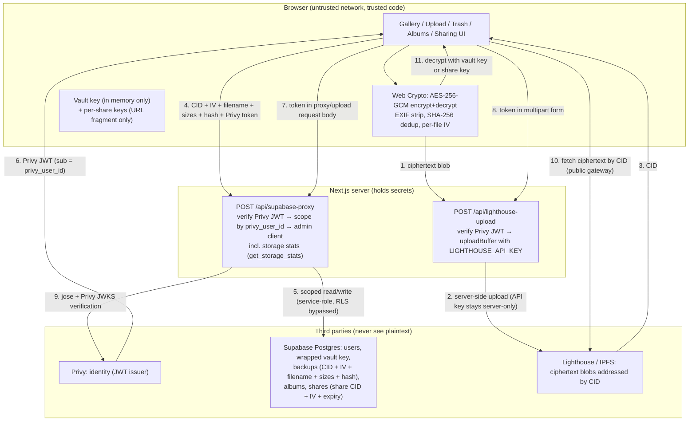

# Vaultly

Vaultly is a private photo and video vault for people who want Google Photos-style backup without handing plaintext memories to the storage provider. Files are stripped of EXIF and encrypted in the browser with AES-256-GCM before any network transfer; only opaque ciphertext is stored on Lighthouse/IPFS, while Supabase holds ciphertext pointers (CIDs) plus the metadata needed to organize them. That split is the core technical decision: a storage breach yields undecryptable blobs, and a database breach yields filenames and pointers but no image bytes.

## Architecture



Media path: browser → Web Crypto encryption → `/api/lighthouse-upload` → Lighthouse/IPFS → CID + metadata → `/api/supabase-proxy` → Supabase. Auth path: Privy → JWT → server-side `jose`/JWKS verification → `privy_user_id` → internal `users.id` lookup → admin-client queries scoped to that user. The server never receives a vault key, a share key, or a plaintext file.

## Features (implemented)

- **Encrypted upload**: EXIF strip (JPEG/JPG/HEIC/HEIF via canvas redraw), SHA-256 dedup check, AES-256-GCM encrypt (single-shot ≤ 20 MB, chunked above), ciphertext upload through `/api/lighthouse-upload`, metadata insert through `/api/supabase-proxy`.
- **Gallery**: paginated backup list, photo/video filter, newest/oldest sort, client-side decrypted thumbnails, restore-to-download.
- **Trash**: soft delete (`deleted_at` set), restore (`deleted_at` cleared), permanent delete (metadata row deleted). UI shows a 30-day countdown; see Known limitations.
- **Albums**: create, list, add backup, remove backup, list album contents. Ownership-checked on every operation.
- **Activity**: derived list of recent uploads/deletes from the `backups` table (no separate event store).
- **Secure sharing**: per-share re-encryption with a fresh AES-256-GCM key, new ciphertext + new CID, share row with expiry, owner-only revoke, public view page at `/share/[id]` that decrypts with the key from the URL fragment. Share keys are never sent to or stored on the server.
- **Key management**: per-user random vault key generated client-side at passphrase setup, AES-KW-wrapped under a passphrase-derived key, stored as `encryption_keys.encrypted_key_blob` + plaintext `key_salt` with `key_version`. The vault unlocks per session and the unwrapped key lives only in tab memory.
- **Storage stats**: per-user file count and byte totals computed from `backups.encrypted_size` / `original_size`.

## Tech stack

| Technology | Why it was chosen |
|---|---|
| Next.js 15 (App Router) + React 19 | Single host for UI and the two secret-holding routes (`supabase-proxy`, `lighthouse-upload`), so API keys never ship to the client. |
| Privy (`@privy-io/react-auth`) | Outsourced identity (email, OAuth, wallets) with short-lived JWTs the server can verify without running its own auth. |
| Supabase Postgres (`@supabase/supabase-js`, `@supabase/ssr`) | Metadata-only store with row-level security available; admin client used server-side for ownership-scoped queries. Supabase Storage is intentionally not used. |
| Lighthouse / IPFS (`@lighthouse-web3/sdk`) | Content-addressed blob store: returns a CID the DB can reference, retrievable over public IPFS gateways without Vaultly running a storage backend. |
| Web Crypto AES-256-GCM + AES-KW, PBKDF2 (`jose` for JWT verify) | Browser-native encryption (no key material in JS bundles); `jose` + Privy JWKS for server-side JWT verification. |
| `@uppy/core` (core only, no UI component) | Used minimally as a file-queue/restriction helper inside the custom dropzone; the visible uploader is custom (`UploadZone`). |
| Zustand + TanStack Query | Local upload-queue state (Zustand) separated from server-state caching/pagination (Query). |
| Tailwind CSS + Radix UI + Framer Motion | Utility styling with accessible primitives; motion used for sheet/modal/queue feedback. |
| Zod | Every proxy operation payload is schema-validated server-side before touching the DB. |
| Vitest + Playwright, `STORAGE_PROVIDER=mock` | Unit/integration tests run against a local mock blob store (`.test-storage/`, git-ignored) so CI uses no Lighthouse credits. |
| Sentry (optional) | Client/server error reporting; empty DSN disables it. |

## Security model

**What the server can see.** Supabase rows contain: `original_filename`, `mime_type`, `original_size`, `encrypted_size`, `original_hash` (SHA-256 of the EXIF-stripped file), `cid`, `iv` (base64), `thumbnail_cid` (when set), `share_cid`/`iv`/expiry/view counts, and the AES-KW-wrapped vault key (`encrypted_key_blob`) plus its plaintext salt (`key_salt`; salts are not secret). Lighthouse sees only ciphertext blobs. Anyone with a CID can fetch the ciphertext from a public gateway, but without the key + IV it is AES-GCM ciphertext.

**What the server never receives.** Plaintext file bytes (encryption happens before `fetch`), the unwrapped vault master key (kept in browser memory, persisted only in wrapped form), and share keys (generated per share, carried only in the URL fragment `#key=…`, which browsers do not send over the network).

**Privy → Supabase bridge.** The client obtains a Privy access token (`getAccessToken()`) and includes it as `token` in each `POST /api/supabase-proxy` body (multipart `token` field for `/api/lighthouse-upload`). The route verifies it with `jose` against Privy's remote JWKS (`https://auth.privy.io/api/v1/apps/<app_id>/jwks.json`, issuer `privy.io`), extracts `sub` as `privy_user_id`, resolves the internal `users.id`, and scopes every query by `user_id` / `owner_user_id` using the service-role admin client. Zod schemas reject malformed payloads; the middleware adds per-IP/per-subject rate limits and verifies the `privy-token` cookie (static `PRIVY_VERIFICATION_KEY`, ES256/RS256) for the remaining protected API path. RLS policies are enabled on all tables but are **defense-in-depth only** — the primary gate is the proxy's token verification + ownership check, because the admin client bypasses RLS by design.

**Sharing without exposing the master key.** Creating a share decrypts the file in the browser with the vault key, generates a fresh random AES-256-GCM share key + IV, re-encrypts, uploads the new ciphertext to a new CID, and stores only the new CID + IV server-side. The raw share key is base64url-encoded into the link fragment (`/share/<id>#key=…`). The public viewer calls unauthenticated `get_share_public`, which returns CID/IV/filename only after checking `revoked_at`/`expires_at`, fetches the ciphertext, and decrypts locally. Revoking sets `revoked_at`; viewing an expired or revoked link returns a generic 404 with no metadata leak.

**Passphrase-derived key wrapping.** The AES-KW wrapping key is derived from the user's vault passphrase via PBKDF2-SHA256 (600,000 iterations, the current OWASP floor) with a random 16-byte per-vault salt stored alongside the wrapped blob. The passphrase itself is never stored or transmitted; the server holds only the wrapped key and the salt, so it can neither unwrap the vault key nor brute-force it without the passphrase. The unwrapped key lives only in tab memory and is cleared on logout or tab close — each new session requires the passphrase again. The tradeoff is explicit and stated in the setup UI: losing the passphrase means permanent, unrecoverable data loss. There is no reset.

Additional controls: EXIF is stripped before hashing/encryption; duplicate uploads are rejected by hash; error responses are generic (`Something went wrong`) with details logged server-side; security headers (CSP, `frame-ancestors 'none'`, HSTS, `X-Content-Type-Options`) are set in `next.config.ts`.

## Local setup

Prerequisites: Node 20+, npm, a Supabase project, a Privy app, a Lighthouse API key.

1. Clone and install:
   ```bash
   git clone <your-repo-url> vaultly
   cd vaultly
   npm install
   ```
2. Create the env file (PowerShell: `copy .env.example .env.local`; macOS/Linux: `cp .env.example .env.local`) and fill in every variable below.
3. In Supabase: open the SQL editor and run **all** migrations in `supabase/migrations/` in numeric order (`0001_init.sql` → `0010_phase1_schema_repairs.sql`). This creates `users`, `encryption_keys`, `backups` (+ `deleted_at`), `albums`, `album_backups`, `shares`, indexes, RLS policies, and the schema-verification RPC.
4. In Privy (dashboard → your app): copy the App ID and the verification public key.
5. In Lighthouse (dashboard → API keys): create an API key.
6. Run:
   ```bash
   npm run dev
   ```
   Open `http://localhost:3000`. Sign in, upload a small test file, log out, log back in, confirm the gallery entry, restore it.
7. Pre-push verification (no Lighthouse credits used — tests force `STORAGE_PROVIDER=mock`):
   ```bash
   npm run verify:all
   ```
   This runs typecheck + production build + live schema audit + the Vitest suite. See `TESTING.md` for the one remaining manual live-Lighthouse upload check.

### Environment variables

| Variable | Where to get it | Purpose |
|---|---|---|
| `NEXT_PUBLIC_APP_URL` | You decide (`http://localhost:3000` locally; your deploy URL in prod) | Redirects and absolute share-link origin. |
| `NEXT_PUBLIC_PRIVY_APP_ID` | Privy dashboard → App → App ID | Client-side Privy initialization; also the JWT audience the server checks. |
| `PRIVY_VERIFICATION_KEY` | Privy dashboard → App → Verification key (public key, PEM) | Server-side verification of the `privy-token` cookie in middleware. Never prefix with `NEXT_PUBLIC_`. |
| `NEXT_PUBLIC_SUPABASE_URL` | Supabase dashboard → Project Settings → API → Project URL | Client + server project address. |
| `NEXT_PUBLIC_SUPABASE_ANON_KEY` | Supabase dashboard → Project Settings → API → anon public key | Client-side anon usage; all privileged reads/writes go through the proxy instead. |
| `SUPABASE_SERVICE_ROLE_KEY` | Supabase dashboard → Project Settings → API → service_role (secret) | Server-only. Powers the admin client in `/api/supabase-proxy`. Never expose to the client. |
| `LIGHTHOUSE_API_KEY` | Lighthouse dashboard → API keys | Server-only. Used in `/api/lighthouse-upload` via `uploadBuffer`. |
| `STORAGE_PROVIDER` | You decide: `lighthouse` (default/prod) or `mock` (tests only) | Selects real Lighthouse vs. local `.test-storage/` mock blobs. |
| `NEXT_PUBLIC_SENTRY_DSN` / `SENTRY_DSN` | Sentry dashboard → Project → DSN (optional; leave empty to disable) | Browser / server error reporting. |

## Known limitations (stated plainly)

- **No automated trash purge.** The trash UI counts down 30 days from `deleted_at`, but no cron or worker deletes rows when the countdown hits zero. Items stay until the user clicks Delete Forever. The cron design (schedule, batch size, gateway unpin strategy) is still pending.
- **No automated share-expiry cleanup.** Expired shares are filtered from `list_shares` and rejected by `get_share_public` with a generic 404, but the rows are not deleted by any job.
- **Hard delete removes metadata, not ciphertext.** `hard_delete_backup` deletes the `backups` row; the ciphertext blob remains addressable on IPFS by CID (content-addressed storage has no reliable delete). The app stops referencing it, but do not promise cryptographic erasure.
- **Mock storage ≠ real Lighthouse.** `npm run verify:all` and the Vitest suite cover encryption, proxy auth, DB flows, and upload/retrieve plumbing against local mock blobs. The single uncovered integration is a real funded-Lighthouse upload + gateway retrieval (see `TESTING.md`).
- **Thumbnails are derived, not separately uploaded.** The gallery decrypts the full ciphertext client-side and downscales for preview; `thumbnail_cid` exists in the schema but the current upload path does not populate it.
- **Share re-encryption is memory-bound.** `createShare` / `reEncryptForShare` hold decrypted bytes in memory; very large files can strain low-memory browsers. Chunked share streaming is not implemented.

## Roadmap

- Cron purge for trash past retention + expired/revoked shares, with best-effort IPFS unpinning.
- Passphrase change + re-wrap flow (currently the passphrase is set once; rotation is not yet implemented).
- Streaming/chunked share re-encryption for large files.
- Real thumbnail pipeline (encrypted thumbnails with their own CIDs/IVs).
- Funded-Lighthouse end-to-end check recorded in `TESTING.md`, then CI badge.
